### 《智能体云原生开发》期末大作业

> **💡 快速开始提示**：如需运行本项目，请直接查看 [5.1 快速开始](#51-快速开始) 章节。

#### 一、摘要

##### 1.  我们小组选择**命题一**，旨在开发一个基于大模型的 PPT 智能扩展与辅助学习 Agent。我们实现了一个完整的云原生智能体系统，核心功能摘要如下：

    1.  **PPT 深度语义解析**：基于 `python-pptx` 实现了对 PPT 文件的结构化提取，能够准确识别标题、正文及层级关系。
    2.  **智能知识扩展 (RAG + Agent)**：利用 `LangGraph` 构建了具备“检索-决策-生成-校验”能力的智能体工作流。系统能自动判断知识点是否需要外部搜索（Arxiv/Semantic Scholar），并利用向量数据库 (`Milvus`) 进行检索增强生成。
    3.  **个性化学习仪表盘**：集成用户画像与学习路径规划功能，支持设定学习目标、生成每日任务清单，并基于用户兴趣推荐相关学术资源，打造“伴随式”学习体验。
    4.  **云原生微服务架构**：系统完全容器化，后端服务、Redis 消息队列、Milvus 向量库均通过 `Docker Compose` 编排，具备良好的扩展性与部署便捷性。
    5.  **全栈交互体验**：提供了基于 React 的前端界面与 FastAPI 后端服务，支持文件上传、异步任务处理及生成结果的实时展示。

##### 2. **团队分工**（贡献度均为33.3%，组内均分）

- 韩悦（10213903418）：智能体架构与编排
  - **负责模块**：LangGraph 工作流、PPT 基础结构解析、PPT 图片解析 (OCR)。
  - **核心贡献**：设计并实现了“检索-决策-生成-校验”的闭环工作流；优化了 Prompt 工程以提升 Agent 的语义理解与容错能力；利用 `python-pptx`, `PyMuPDF` 与 OCR 技术解决了 PPT、PDF 及 Word 等多模态数据的提取难题。

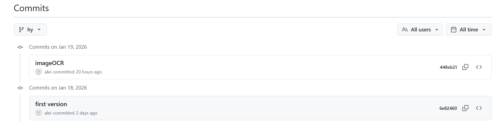

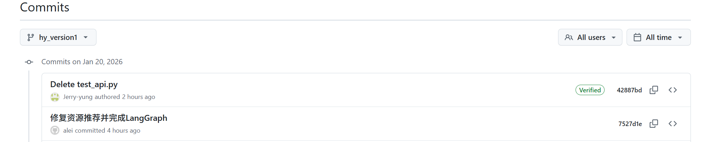

- 贾馨雨（10235501437）：全栈业务与个性化
  - **负责模块**：用户注册登录、学习目标控制、个性化推荐系统、前端开发。
  - **核心贡献**：构建了完整的用户认证体系；实现了基于用户画像的个性化学习计划生成算法；完成了 React 前端与后端 API 的对接；撰写**实验报告**。

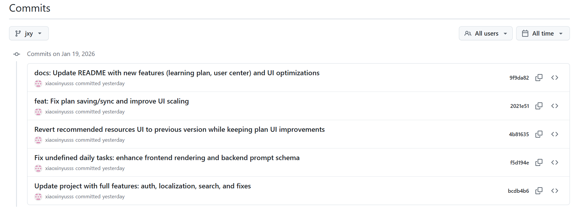

- 杨云天（10245501405）：数据检索与多模态解析
  - **负责模块**：多源搜索 API、参考文件上传解析 (PDF/Word)。
  - **核心贡献**：封装了 Arxiv/Semantic Scholar 等多源搜索接口，并实现了功能整合；录制**demo**视频

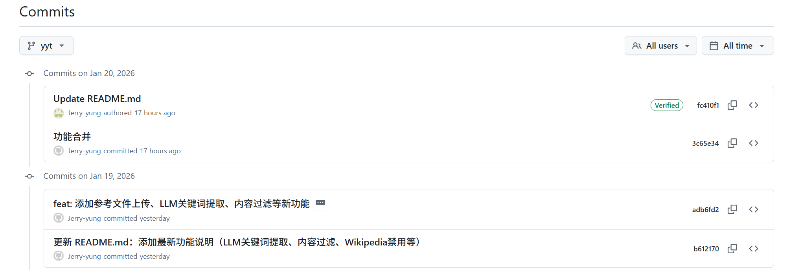

#### 二、 架构设计

#### 2.1 系统架构图与数据流向

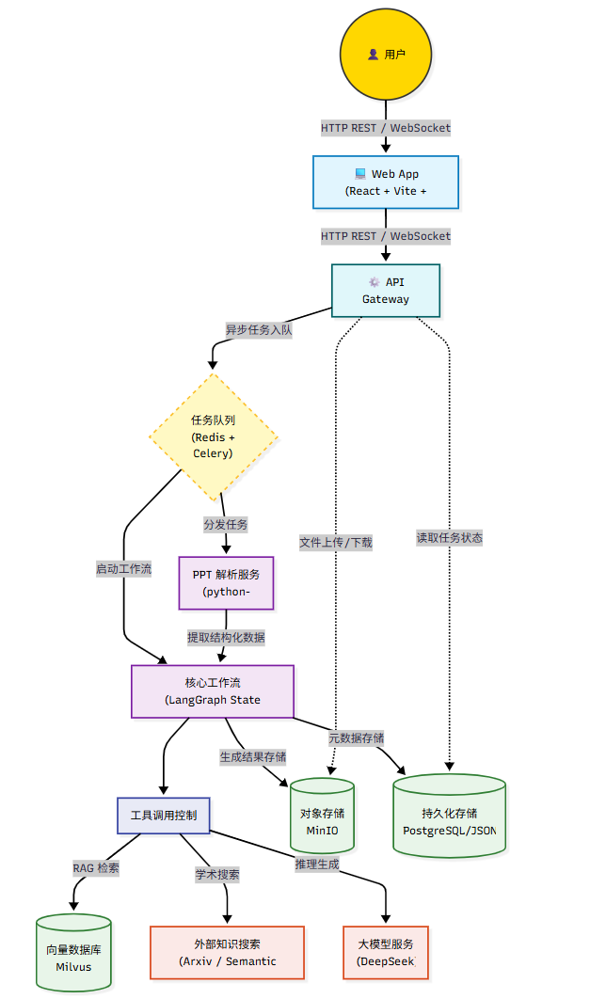

**数据流向说明**：

1.  **用户操作**: 用户通过前端上传PPT并触发扩展任务。
2.  **API 接收**: API网关接收请求，创建异步任务并存入Redis队列。
3.  **任务分发**: Celery Worker (集成在 Agent 服务中) 消费任务，启动解析服务提取PPT文本和结构。
4.  **智能编排**: 解析后的结构化数据送入LangGraph智能体工作流。
5.  **工具调用**: 智能体根据策略，依次调用向量检索（RAG）、外部搜索和LLM生成等工具。
6.  **结果存储**: 最终生成的扩展内容与原始PPT关联，存储于 MinIO 和 本地数据文件（生产环境可迁移至 PostgreSQL）。
7.  **前端展示**: 前端通过轮询获取任务结果并展示。

#### 2.2 云原生组件清单

| 组件            | 版本     | 用途                                                         | 容器名             | 命题对应与考核点                                             |
| --------------- | -------- | ------------------------------------------------------------ | ------------------ | ------------------------------------------------------------ |
| **Docker**      | 24+      | 应用容器化与编排基石                                         | -                  | **云原生核心**：实现环境一致性，避免“单一脚本运行”。         |
| **Redis**       | 7-alpine | 1) Celery任务队列Broker<br>2) 用户会话缓存<br>3) Agent中间状态缓存 | `ppt-agent-redis`  | **容错与性能**：异步解耦，提升系统响应与稳定性。             |
| **Milvus**      | v2.3.x   | 存储PPT切片及扩展知识的向量，实现语义相关性检索              | `ppt-agent-milvus` | **命题核心**：实现基于语义的RAG，支撑“联想内容相关度”考核。  |
| **MinIO**       | RELEASE  | 对象存储，用于存放用户上传的原始PPT文件和生成的扩展文档      | `ppt-agent-minio`  | **云原生存储实践**：分离数据与计算。                         |
| **Etcd**        | v3.5.x   | Milvus的元数据存储依赖                                       | `ppt-agent-etcd`   | 支撑分布式向量数据库的运行。                                 |
| **Persistence** | -        | 用户数据与任务状态存储                                       | (Internal)         | **数据持久化**：当前使用 JSON 文件存储，设计上支持 PostgreSQL 扩展。 |

#### 2.3 LLM Agent 工具链

- **核心框架**：`langchain`, `langgraph` (工作流编排), `langchain-openai` (兼容DeepSeek API)
- **文档解析**：`python-pptx` (PPTX), `PyMuPDF` (PDF参考文档), `python-docx` (Docx参考文档)
- **文本处理与向量化**：`sentence-transformers` (all-MiniLM-L6-v2 生成Embedding), `pymilvus` (向量检索客户端)
- **外部知识搜索**：`arxiv` (学术论文), `Semantic Scholar` (学术搜索), `Crossref` (学术文献), `OpenAlex` (开放学术图谱)
- **其他工具**：`pytesseract` (OCR), `requests` (API调用)

---

### 三、 核心功能与工作流

#### 3.1 用户操作流程

1.  **上传与分析**：用户上传PPT文件。系统解析并展示其大纲结构（目录、标题、页面预览）。
2.  **选择与配置**：用户选择需要扩展的特定页面或全部页面，可选择附加参考文档（PDF/Docx）。
3.  **触发扩展**：用户点击“智能扩展”，系统创建异步任务。
4.  **异步处理**：后端智能体按工作流（见下文智能体策略）进行处理，用户可在任务中心查看实时状态。
5.  **查看与导出**：处理完成后，用户可在交互式界面中通过分栏（背景、原理、公式、示例、总结）查看生成的扩展内容，并支持导出为 Markdown 或 PDF 格式。
6.  **导出**：将扩展后的完整内容导出为新的PPTX或Markdown文件。

#### 3.2 功能模块详解

##### 语义解析模块

- **输入**：`.pptx` 文件。
- **输出**：结构化JSON，包含 `slides[] -> title, body_text, shapes (类型、位置、文本), notes`。
- **挑战应对**：处理复杂布局、SmartArt、图表标题的提取。

##### 知识扩充模块

- **分块与向量化**：将解析出的文本按语义分块，通过 `sentence-transformers` 生成向量，存入 Milvus。
- **检索**：用户查询时，将当前幻灯片标题/内容向量化，在 Milvus 中进行相似性检索，返回最相关的 k 个知识块。
- **生成**：将原始内容、检索到的相关上下文、外部搜索结果（基于 DecideSearch 节点的决策结果）组合成 Prompt，送入 LLM 生成扩展内容。

##### 多维搜索模块

- **策略**：由智能体决策节点判断是否需要及调用哪个外部搜索工具。
- **结果处理**：对搜索结果进行摘要、去重和可信度标注。

### 四、智能体策略

遵循“规划(Plan) -> 执行(Act) -> 校验(Check) -> 修复(Repair)”的闭环，内置容错。

#### 4.1 LangGraph 工作流设计

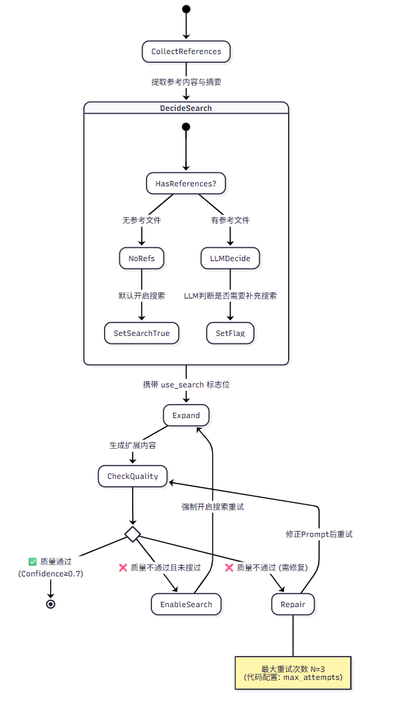

**节点详解**：

- **DecideSearch (决策节点)**：
  - **Prompt目标**：判断当前PPT知识点上下文是否足够进行高质量扩展。
  - **输入**：幻灯片标题、正文、已有的参考文档摘要。
  - **输出**：`{"use_search": boolean, "reason": str}`。
  - _注：此节点仅设置标志位，实际搜索动作由 Expand 节点内部服务执行。_

- **Expand (扩展生成节点)**：
  - **输入**：原始内容 + 参考文档片段 + 搜索结果（如果有）。
  - **核心Prompt**：严格遵循结构化输出要求（JSON），强调基于给定信息生成，减少幻觉。
  - _注：若 `use_search` 为 True，此节点会先调用 `SearchService` 执行多源搜索。_

- **CheckQuality (校验层节点)**：
  - **目的**：实现“注重容错”要求，对抗模型幻觉。
  - **检查项**：事实一致性、格式合规性、内容完整性、与原始主题的相关性。
  - **“低温”LLM**：使用更低温度（temperature=0.1）的LLM进行严谨性检查。

- **Repair (修复节点)**：
  - **策略**：根据CheckQuality返回的具体错误信息，重构或修正Prompt，直接生成修复后的内容，并再次送入 CheckQuality 节点。

#### 4.2 关键Prompt模板

````python
# 1. 搜索决策Prompt (对应DecideSearch节点)
def get_search_decision_prompt(title, content, context="无", reference_excerpt="无"):
    return f"""你是一位“学习资料检索策略”的决策助手。现在系统将为PPT知识点生成扩展内容。
你需要决定：在已经有“用户参考文件”的情况下，是否还需要外部检索（Arxiv / Semantic Scholar / Crossref / OpenAlex）。

**标题**: {title}
**原始内容**:
{content}
**上下文信息**:
{context}
**用户参考文件摘录**:
{reference_excerpt}

**决策规则**:
1. 如果参考文件已充分覆盖核心概念、定义、公式、步骤：可以不进行外部检索（use_search=false）。
2. 如果参考文件内容不够、含糊、缺少来源、或可能需要更权威论文/定义支撑：应进行外部检索（use_search=true）。
3. 若参考文件与主题相关性弱：use_search=true。
4. 你只做决策，不要输出解释性长文。

**输出格式**（必须严格 JSON，不要 Markdown）:
{{
  "use_search": true/false,
  "reason": "一句话原因（<=30字）"
}}
"""

# 2. 校验层Prompt (对应CheckQuality节点)
def get_check_layer_prompt(original, expansion_json, reference_excerpt="无", used_search=False):
    return f"""你是一位专业的“内容校验(Check Layer)审核员”。你要严格检查扩展内容是否存在幻觉、错误或不一致。

**原始内容**:
{original}

**扩展内容(JSON)**:
{expansion_json}

**用户参考文件摘录**:
{reference_excerpt}

**是否已使用外部检索**: {"是" if used_search else "否"}

**审核标准**:
1. 语义相关性：扩展是否围绕原始内容展开？
2. 事实准确性：是否出现明显错误、编造术语/论文/结论？
3. 一致性：内部是否自相矛盾？是否与参考文件冲突？
4. 可验证性：如果给出“引用/论文/链接”，是否看起来合理？

**输出格式**（必须严格 JSON，不要 Markdown）:
{{
  "is_relevant": true/false,
  "is_accurate": true/false,
  "is_consistent": true/false,
  "confidence": 0.0,
  "issues": ["问题1", "问题2"]
}}

**阈值**:
- confidence >= 0.7 且三个 is_* 均为 true 才算通过
"""

# 3. 知识扩展Prompt (对应Expand节点，带参考文件的版本)
def get_expansion_prompt_with_reference_files(title, content, context="无", reference_contents=None, search_results=None):
    return f"""你是一位专业的教育内容扩展助手，擅长将简短的知识点扩展为详细的学习材料。**请优先使用用户提供的参考文件内容**，结合外部权威资料为PPT知识点生成详细的扩展内容。

**标题**: {title}
**原始内容**: {content}
**上下文信息**:
{context}
**用户提供的参考文件**（优先使用）:
{{reference_text}}
**外部权威参考资料**（作为补充）:
{{references_text}}

**扩展要求**:
1. **背景说明**: 解释知识点的来龙去脉... **优先参考用户提供的参考文件中的信息**
2. **原理阐述**: 详细阐述核心原理... **优先结合参考文件中的权威观点**
3. **公式推导**: 如有数学公式，请提供完整的推导过程（使用LaTeX格式，如 $E=mc^2$）
4. **代码示例**: 如有编程实现，请提供Python代码示例，并添加详细注释
5. **要点总结**: 总结核心要点，便于快速复习

**输出格式**（必须严格按照以下JSON格式输出）:
```json
{{
    "background": "背景说明内容...",
    "principles": "原理阐述内容...",
    "formulas": "公式推导内容（如适用）",
    "examples": "代码示例内容（如适用）",
    "summary": "要点总结内容..."
}}
````

### 五、 系统部署与运行指南

#### 5.1 快速开始

---

##### 🚀 后端服务部署（Docker Compose）

1. **克隆项目代码**
    ```bash
    git clone -b hy_version1 https://github.com/alei2024/ppt-extension-agent.git ppt-extension-agent-hy_version1
    cd ppt-extension-agent-hy_version1
    ```

2. **配置环境变量**
    ```bash
    cp env.example .env
    # 编辑 .env，填写 LLM_API_KEY 等必需参数
    ```

3. **启动后端全套服务（API, Redis, Milvus, MinIO）**
    ```bash
    docker-compose up -d
    ```

4. **访问后端接口和文档**
    - API 文档地址：[http://localhost:8000/docs](http://localhost:8000/docs)

---

##### 💻 前端应用启动（React + Vite）

1. **进入前端目录**
    ```bash
    cd frontend
    ```

2. **安装前端依赖**
    ```bash
    npm install
    ```

3. **本地开发模式启动**
    ```bash
    npm run dev
    ```

4. **访问前端应用**
    - 前端地址：[http://localhost:3000](http://localhost:3000)
    - *默认已配置代理转发到后端 8000 端口*

---


#### 5.2 项目目录结构

```text
ppt-extension-agent-hy_version1/
├── agents/                   # LangGraph智能体工作流
│   └── ppt_agent.py          # 智能体核心实现
├── api/                      # 路由端点
│   ├── auth_routes.py        # 用户认证路由
│   ├── learning_routes.py    # 学习计划路由
│   └── routes.py             # 主要业务路由
├── app/                      # 应用配置与入口
│   ├── config.py             # 配置管理
│   └── main.py               # FastAPI应用入口
├── frontend/                 # React前端项目
│   └── src/
│       ├── components/       # 核心组件库
│       │   ├── Auth/              # 认证组件 (Login/Register)
│       │   ├── CodeHighlighter/   # 代码高亮组件
│       │   ├── Dashboard/         # 任务看板
│       │   ├── ExpansionPanel/    # 扩展内容展示 (分栏视图/导出)
│       │   ├── MathRenderer/      # 数学公式渲染
│       │   ├── PPTFeature/        # PPT功能组件
│       │   ├── PPTViewer/         # PPT结构化预览
│       │   ├── ProgressBar/       # 进度条组件
│       │   ├── ReferenceFileUpload/ # 参考文件上传
│       │   ├── UploadArea/        # 文件上传区域
│       │   └── UserProfile/       # 用户个人中心
│       └── services/         # 前端API服务
├── img/                      # README文档图片资源
├── logs/                     # 运行日志
├── output/                   # 生成结果输出
├── services/                 # 业务逻辑服务
│   ├── export_service.py     # 结果导出 (Markdown/PPTX)
│   ├── image_recognizer.py   # 图片OCR与描述生成
│   ├── knowledge_expander.py # 知识扩展生成器
│   ├── parser.py             # PPT解析核心
│   ├── reference_parser.py   # 参考文件解析与相关性判断
│   ├── search_service.py     # 多源外部搜索
│   └── user_service.py       # 用户管理
├── uploads/                  # 文件上传目录
├── utils/                    # 工具函数
│   ├── auth.py               # 认证工具
│   ├── llm_factory.py        # LLM工厂类
│   ├── prompts.py            # Prompt模板
│   └── vector_db.py          # 向量数据库客户端
├── .dockerignore             # Docker忽略文件配置
├── .gitignore                # Git忽略文件配置
├── docker-compose.yml        # 多服务编排定义
├── Dockerfile                # 后端容器构建文件
├── env.example               # 环境变量示例
├── README.md                 # 项目说明文档
├── requirements.txt          # Python依赖列表
└── 《智能体云原生开发》期末大作业.pdf  # PDF项目报告文档（与README.md内容一致）
```

#### 5.3 核心配置说明 (.env)

```ini
# 服务端配置
APP_NAME="PPT Extension Agent"
DEBUG=True

# OpenAI / DeepSeek 配置 (通过 SiliconFlow 或 DeepSeek 官方)
OPENAI_API_KEY=sk-xxxxxx
OPENAI_BASE_URL=https://api.siliconflow.cn/v1

# 向量数据库 (Milvus)
MILVUS_HOST=milvus-standalone
MILVUS_PORT=19530

# Redis 配置
REDIS_HOST=redis
REDIS_PORT=6379

# 对象存储 (MinIO)
MINIO_ENDPOINT=minio:9000
MINIO_ACCESS_KEY=minioadmin
MINIO_SECRET_KEY=minioadmin
```

### 六、项目展示截图

#### **6.1 用户注册登录页面**

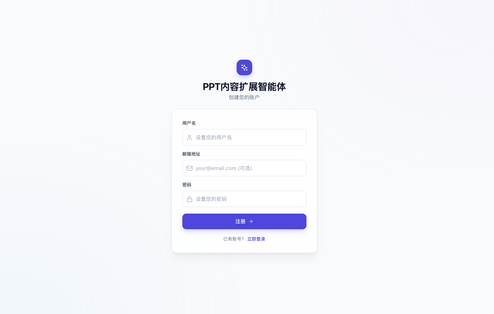

#### 6.2 PPT 上传页面及上传结果示例

##### 6.2.1 PPT 上传界面
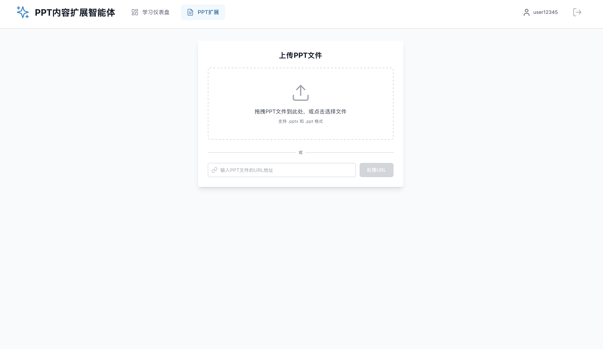

##### 6.2.2 PPT 解析结果
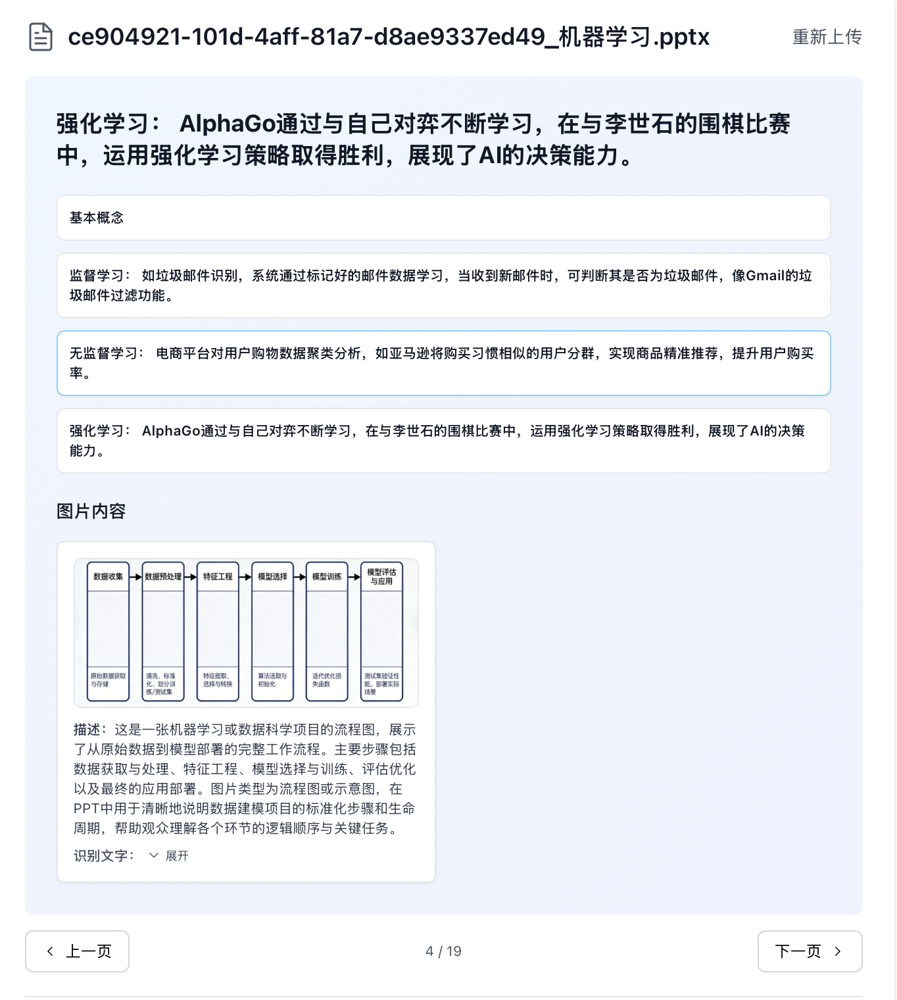

##### 6.2.3 PPT 扩展结果展示
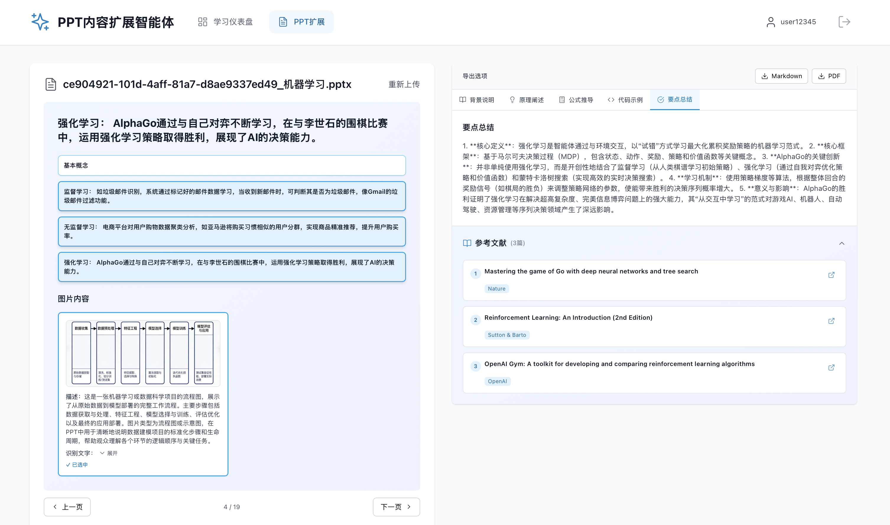

#### 6.3 用户设定学习目标及个性化计划生成

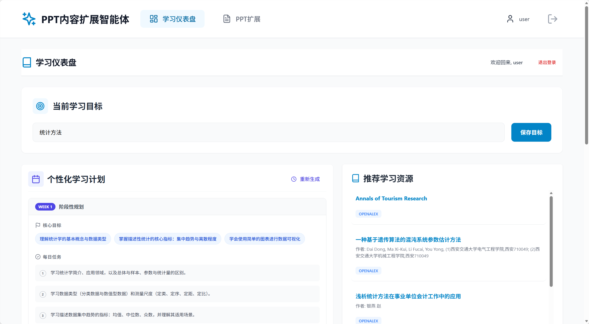

#### 6.4 用户个人主页及历史学习计划

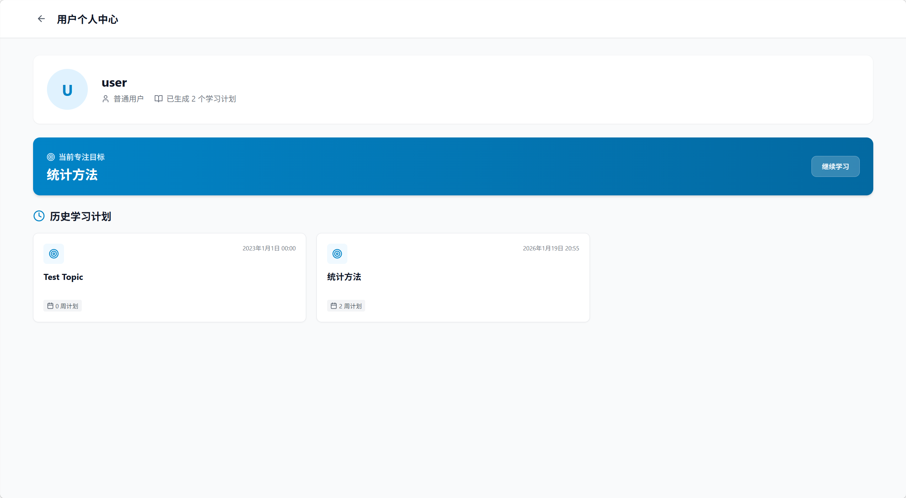
